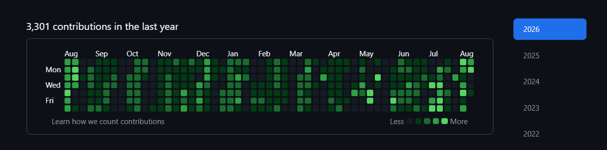

# 🪐 Git Chronos


- GitHub Chronos is a lightweight Node.js utility for `generating Git commits in past days` to fill contribution
  <br>graph with green squares 🟩.
- It provides an interactive CLI for selecting a `date range, commit count`, and controlled commit execution.<br>
  (Missed Days: Where no commit was made)

## 🚀 Features & Highlights

### 🕒 Scheduling
- Choose a custom date range and generate commits on random dates.
- Example: `2025-04-01 → 2025-08-01`

### 🔢 Commit Management
- Set the commit count and keep each commit unique with fresh data.
- Example: `50 commits → 50 unique commits`

### 🛡️ Validation & Reliability
- Validate inputs and handle file or Git errors safely.
- Example: `2025-08-01 → 2025-07-01` = Invalid: Start date must be before end date

### 🧾 Logging & CLI
- Configure the tool and monitor commit progress directly in the IDE's terminal.
- Example: `Committing: 2025-06-15 | Remaining: 24`

### 📤 Git Integration
- Automatically commit changes and push them to the remote repository.
- Example: `All commits pushed successfully!`

## 🧰 Tech Stack Used

- 🟢 **Node.js:** Runtime environment for the CLI utility.
- 🟡 **JavaScript:** Implements scheduling and commit automation logic.
- 🔵 **Simple Git:** Provides programmatic Git command execution.
- 🟣 **Moment.js:** Handles date parsing and date-range calculations.
- 🟠 **Random:** Generates randomized commit dates.
- ⚪ **JSONFile:** Persists generated commit metadata.
- 🔴 **Readline:** Provides interactive terminal input handling.

## 📊 GitHub Contribution Graph

> My GitHub contribution activity throughout the year.



## 🛠️ Setup & Installation

### 1️⃣ Clone the Repository

```bash
git clone https://github.com/deepanshu1420/GitChronos.git
```

### 2️⃣ Navigate to the Project Directory

```bash
cd GitChronos
```

### 3️⃣ Install the Required Dependencies

> Make sure you have `Node.js` installed

```bash
npm install
```

### 4️⃣ Run Git Chronos

```bash
node index.js
```

### 5️⃣ Enter Configuration

> After the script starts, enter the following details in your `code editor's terminal`:

```text
Start date: YYYY-MM-DD
End date: YYYY-MM-DD
Number of commits: 50
```

## ⚠️ Notes

- 🔒 Create a new repository first, then use the tool in that same repository.
- 📅 Keep selected dates within the supported historical range.
- 🌐 Contribution graph updates may take some time to sync after new commits are pushed.
- 🧪 Test with a small commit count before running larger batches.

## 📜 Disclaimer

Use this project at your own risk. `The author is not responsible` for account suspension, account restrictions, contribution discrepancies, repository issues, or any other consequences resulting from its use.